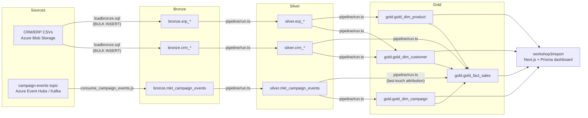
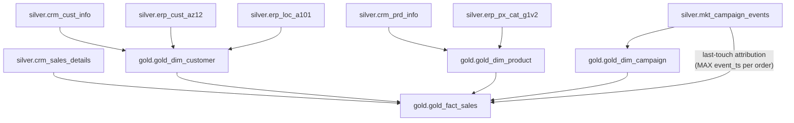

# Data Lineage: Source to Gold

Traces every real dataset from its source through Bronze, Silver, and Gold,
based on the actual scripts and pipeline YAML files in this repo (not
assumed). See `create_governance_docs.md` for the review method and
evidence gathered.

## Lineage table

| Source | Bronze | Silver | Gold | Loaded by |
|---|---|---|---|---|
| `source_crm/cust_info.csv` (Blob Storage) | `bronze.crm_cust_info` | `silver.crm_cust_info` | `gold.gold_dim_customer` | `blobconnector.sql` (external data source) -> `loadbronze.sql` (`bronze.load_bronze`, `BULK INSERT`) -> `pipeline/run.ts` running `crm_cust_info.yaml` -> `pipeline/run.ts` running `gold_dim_customer.yaml` |
| `source_crm/prd_info.csv` (Blob Storage) | `bronze.crm_prd_info` | `silver.crm_prd_info` | `gold.gold_dim_product` | same load path; Silver via `crm_prd_info.yaml`, Gold via `gold_dim_product.yaml` |
| `source_crm/sales_details.csv` (Blob Storage) | `bronze.crm_sales_details` | `silver.crm_sales_details` | `gold.gold_fact_sales` | same load path; Silver via `crm_sales_details.yaml`, Gold via `gold_fact_sales.yaml` |
| `source_erp/CUST_AZ12.csv` (Blob Storage) | `bronze.erp_cust_az12` | `silver.erp_cust_az12` | `gold.gold_dim_customer` (joined in for birthdate/gender) | same load path; Silver via `erp_cust_az12.yaml` |
| `source_erp/LOC_A101.csv` (Blob Storage) | `bronze.erp_loc_a101` | `silver.erp_loc_a101` | `gold.gold_dim_customer` (joined in for country) | same load path; Silver via `erp_loc_a101.yaml` |
| `source_erp/PX_CAT_G1V2.csv` (Blob Storage) | `bronze.erp_px_cat_g1v2` | `silver.erp_px_cat_g1v2` | `gold.gold_dim_product` (joined in for category/subcategory/maintenance) | same load path; Silver via `erp_px_cat_g1v2.yaml` |
| Azure Event Hubs `campaign-events` topic (Kafka protocol) | `bronze.mkt_campaign_events` | `silver.mkt_campaign_events` | `gold.gold_dim_campaign` and `gold.gold_fact_sales` (last-touch attribution join) | `kafka-stream-copy/consume_campaign_events.js` (append-only, not truncated) -> `pipeline/run.ts` running `mkt_campaign_events.yaml` -> `gold_dim_campaign.yaml` and `gold_fact_sales.yaml` |
| `gold.*` (all four tables) | - | - | - | `workshop3/report` (Next.js + Prisma) reads Gold directly for the Sales Trends and Campaign Analytics dashboards; no further copy/materialization beyond Gold |

All Bronze->Silver and Silver->Gold movement in the pipeline runs through
one generic engine, `pipeline/run.ts`: it discovers every `*.yaml` in
`pipeline/yaml/`, sorts by medallion layer (bronze -> silver -> gold, then
filename) so a layer never reads a stale upstream table within the same
run, and executes each file's `transform_sql`/`load_sql`/`verify_sql`/
`checks` in order. There is no per-table code outside the YAML files
themselves.

## End-to-end flow

## Silver -> Gold join detail (the actual dependency graph)

Verified against the real FK constraints (`sys.foreign_keys`) and the
`JOIN`/`LEFT JOIN` clauses in each `gold_*.yaml`'s `load_sql`:

`gold_dim_customer` and `gold_dim_product` load before `gold_fact_sales`
(enforced by `pipeline/run.ts`'s bronze->silver->gold + filename sort,
and by real FK constraints `fk_fact_sales_customer`/`fk_fact_sales_product`/
`fk_fact_sales_campaign` that would reject orphaned rows).

## Lineage tracking today: what exists and what doesn't

**What exists (real, usable today):**
- Every `pipeline/yaml/*.yaml` file states its own `table.source` and
  `table.target`, which *is* machine-readable lineage metadata, just not
  consolidated anywhere until this document.
- `table_details.columns` in each YAML documents column-level
  source-column and transformation for every Bronze->Silver and
  Silver->Gold field - effectively an informal, per-table data dictionary
  with lineage built in (see `governance_handover.md` for the consolidated
  version).
- Comments in `ddl_bronze.sql` document the one exception to the standard
  load pattern (`bronze.mkt_campaign_events` is append-only, not truncated,
  because it's fed by Kafka rather than a batch file).

**What does not exist (gap, not fabricated):**
- No automated/tool-based lineage tracking (no OpenLineage integration, no
  Microsoft Purview scan, no column-level lineage graph stored anywhere).
- No lineage from Gold into the `workshop3/report` dashboard's specific
  KPIs/charts beyond "the Prisma queries read these Gold tables" - which
  query feeds which chart is documented in `create_reporting_app.md`, not
  in a lineage tool.
- If a Bronze/Silver/Gold table is renamed or a YAML file is deleted, this
  document will not update itself - it reflects the state of the repo as
  reviewed, and should be regenerated the same way (reading the actual
  YAML files and DB) if the pipeline changes materially.
