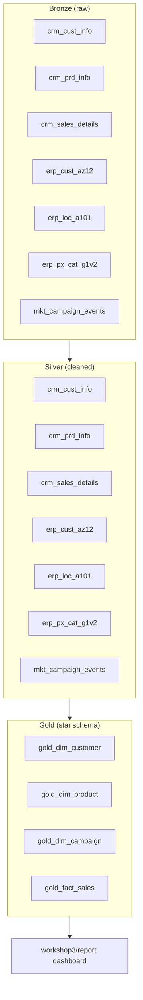
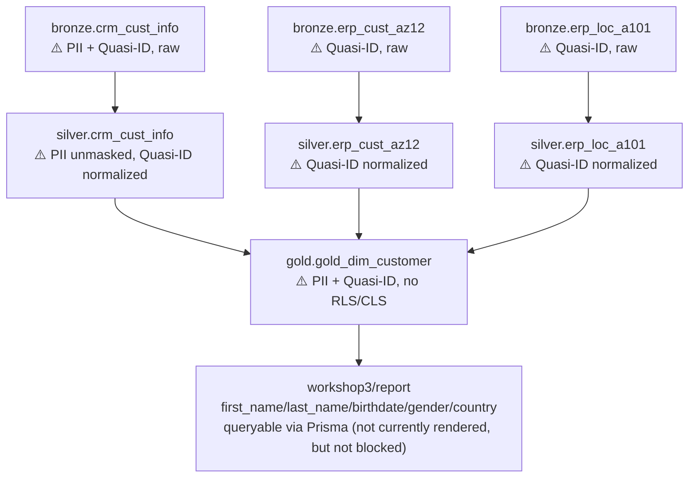

# Governance Handover

Data Governance Architect review of the full project (Workshops 1-4) and
the live `DataWarehouse36` database. Everything below is based on files
read and queries run against the actual project/database - see
`create_governance_docs.md` for the evidence-gathering method, and
`data_lineage.md` for the full source-to-Gold lineage this document
summarizes. No dataset, column, owner, classification, or recommendation
below is invented; anything unsupported by evidence is recorded as a gap.

## 1. Metadata and data dictionary

Classification is populated **only** where the evidence supports it (per
`security_handover.md`'s own PII findings, re-verified against the current
schema). Everything else is marked "-" rather than guessed.
Legend: **PII** = direct identifier, **Quasi-ID** = re-identifying in
combination, **Sensitive** = commercially sensitive, non-personal.
**Owner** is "Unknown" for every table - no owner metadata exists anywhere
in the project or database (see Finding 6).

### Bronze (raw, as loaded - 7 tables, 0 rows classified/masked in the DB)

| Table | Column | Type | Classification | Source |
|---|---|---|---|---|
| `bronze.crm_cust_info` | cst_id | INT | - | `cust_info.csv` |
| | cst_key | NVARCHAR(50) | - | `cust_info.csv` |
| | cst_firstname | NVARCHAR(50) | **PII** | `cust_info.csv` |
| | cst_lastname | NVARCHAR(50) | **PII** | `cust_info.csv` |
| | cst_marital_status | NVARCHAR(50) | **Quasi-ID** | `cust_info.csv` |
| | cst_gndr | NVARCHAR(50) | **Quasi-ID** | `cust_info.csv` |
| | cst_create_date | DATE | - | `cust_info.csv` |
| `bronze.crm_prd_info` | prd_id, prd_key, prd_nm, prd_line | INT/NVARCHAR | - | `prd_info.csv` |
| | prd_cost | INT | **Sensitive** | `prd_info.csv` |
| | prd_start_dt, prd_end_dt | DATETIME | - | `prd_info.csv` |
| `bronze.crm_sales_details` | sls_ord_num, sls_prd_key, sls_cust_id | NVARCHAR/INT | - | `sales_details.csv` |
| | sls_order_dt, sls_ship_dt, sls_due_dt | INT (YYYYMMDD) | - | `sales_details.csv` |
| | sls_sales, sls_price | INT | **Sensitive** | `sales_details.csv` |
| | sls_quantity | INT | - | `sales_details.csv` |
| `bronze.erp_cust_az12` | cid | NVARCHAR(50) | - | `CUST_AZ12.csv` |
| | bdate | DATE | **Quasi-ID** | `CUST_AZ12.csv` |
| | gen | NVARCHAR(50) | **Quasi-ID** | `CUST_AZ12.csv` |
| `bronze.erp_loc_a101` | cid | NVARCHAR(50) | - | `LOC_A101.csv` |
| | cntry | NVARCHAR(50) | **Quasi-ID** | `LOC_A101.csv` |
| `bronze.erp_px_cat_g1v2` | id, cat, subcat, maintenance | NVARCHAR(50) | - | `PX_CAT_G1V2.csv` |
| `bronze.mkt_campaign_events` | event_id, cmp_id, cmp_key, cmp_name, cmp_channel, cmp_type, cmp_discount_pct, sls_ord_num | NVARCHAR/INT | - | Event Hubs `campaign-events` topic |
| | applied_dt, event_ts, dwh_load_date | DATE/DATETIME2 | - | same |

### Silver (cleaned/standardized - 7 tables)

Column-level transformations are fully documented in
`pipeline/yaml/*.yaml`'s `table_details.columns` - not repeated here in
full; classification carries forward from Bronze since cleaning doesn't
change what a column represents.

| Table | PII / Quasi-ID / Sensitive columns | Real cleaning applied (verified via Part 3 checks, all passing) |
|---|---|---|
| `silver.crm_cust_info` | `cst_firstname`/`cst_lastname` (PII), `cst_marital_status`/`cst_gndr` (Quasi-ID) | Whitespace trimmed; gender/marital status standardized to Male/Female/Single/Married/n-a; **names are NOT masked** |
| `silver.crm_prd_info` | `prd_cost` (Sensitive) | NULL cost -> 0; `prd_end_dt` recomputed from version sequencing |
| `silver.crm_sales_details` | `sls_sales`/`sls_price` (Sensitive) | Invalid YYYYMMDD dates nulled; sales/price reconciled where inconsistent |
| `silver.erp_cust_az12` | `bdate`/`gen` (Quasi-ID) | Future/sentinel birthdates nulled; gender standardized |
| `silver.erp_loc_a101` | `cntry` (Quasi-ID) | Country codes standardized (US/USA -> United States, DE -> Germany) |
| `silver.erp_px_cat_g1v2` | - | Passthrough, already clean |
| `silver.mkt_campaign_events` | - | Deduplicated by `event_id`; no PII present |

### Gold (star schema - 4 tables)

| Table | Column | Classification |
|---|---|---|
| `gold.gold_dim_customer` | first_name, last_name | **PII** (unmasked - see Finding 2) |
| | country, marital_status, gender, birthdate | **Quasi-ID** (unmasked - see Finding 2) |
| | customer_key, customer_id, customer_number, create_date | - |
| `gold.gold_dim_product` | cost | **Sensitive** |
| | product_key, product_id, product_number, category_id, category, subcategory, maintenance, product_name, product_line, start_date | - |
| `gold.gold_dim_campaign` | discount_pct | **Sensitive** |
| | campaign_key, campaign_id, campaign_code, campaign_name, channel, campaign_type | - |
| `gold.gold_fact_sales` | sales_amount, price | **Sensitive** |
| | sales_key, order_number, product_key, customer_key, campaign_key, order_date, shipping_date, due_date, campaign_applied_date, quantity | - |

**Gap:** no table or column above has a formal classification recorded in
the database itself - `sys.sensitivity_classifications` returned 0 rows
when queried live. The classifications in this document exist only here,
not as queryable SQL Server metadata (see Recommendation P2).

## 2. Lineage summary

Full lineage table and Mermaid diagrams are in `data_lineage.md`. Summary:
6 source datasets (5 Blob-Storage CSVs + 1 Kafka topic) load into 7 Bronze
tables, transform into 7 Silver tables, and converge into a 4-table Gold
star schema consumed by `workshop3/report`. All Bronze->Silver->Gold
movement runs through one generic, YAML-driven engine
(`pipeline/run.ts`) - there is no per-table pipeline code to audit
separately.

## 3. Data architecture

**Security overlay** (where unmitigated PII/quasi-identifiers actually sit
today, per the data dictionary above):

## 4. Findings

1. **P0 credential exposure - still open, unchanged since Workshop 1.**
   `workshop1/blobconnector.sql` contains a hardcoded master key password
   and a live Blob Storage SAS token in plain text, and is tracked in git
   (`git log` shows it in the first commit). The repo has a real GitHub
   remote (`github.com/karthikeyanVK/claude-code-dataarchitect`). This was
   flagged as P0 "before Workshop 2 starts" and was never actioned across
   Workshops 2 or 3.
2. **P1 partially done: normalization yes, masking no.** Silver correctly
   normalizes gender/country and nulls invalid birthdates (verified: all
   related Part 3 data-quality checks pass in the live pipeline run). But
   `cst_firstname`/`cst_lastname` were never masked or tokenized as
   recommended - they flow through Silver and into
   `gold.gold_dim_customer.first_name`/`last_name` as plain text, directly
   queryable via the `workshop3/report` Prisma client (not currently
   rendered on either dashboard page, but nothing prevents a future page
   from selecting them).
3. **P2 not started.** Live queries against `sys.security_policies`,
   `sys.database_audit_specifications`, and `sys.masked_columns` all
   returned 0 rows. There is no RLS, no CLS, no dynamic data masking, and
   no SQL Audit on this database. Only one non-system database user exists
   (`dbo`, `db_owner`) - no separate ingestion/engineering vs. BI roles, so
   the "Bronze/Silver should be restricted to ingestion, not BI" control
   from `security_handover.md` has no technical enforcement.
4. **No formal data dictionary or classification exists in the database.**
   `sys.extended_properties` returned 0 rows - no column descriptions are
   stored as SQL Server metadata. Section 1 of this document is the first
   consolidated dictionary; it exists only as this file, not as queryable
   metadata.
5. **The Workshop 1->2 handoff artifact itself is not version-controlled.**
   `security_handover.md` exists in both `workshop1/` and `workshop2/` but
   `git status` shows both as untracked - the one document meant to carry
   security findings forward could be lost or silently diverge between
   folders without anyone noticing.
6. **No owner metadata exists for any dataset or table**, in the project or
   the database. The closest available fact is the comment atop every
   workshop `.env` (`Auto-populated from az login - foxpr@hotmail.com`),
   which identifies who provisioned the Azure subscription/infrastructure,
   not who owns any specific dataset or table - recorded as a distinct gap,
   not treated as an answer.
7. **Two low-severity project-hygiene gaps**, found while reviewing
   structure: `workshop4/readme.md` is a genuine 0-byte file (violates this
   project's own `CLAUDE.md` rule against empty files), and
   `workshop/workshop.sqlproj` is an unused, empty SQL Database Project
   scaffold with no `.sql` files inside it, alongside the real pipeline
   that does all the actual work.
8. **One control already holds**: Transparent Data Encryption is enabled
   on `DataWarehouse36` (`sys.dm_database_encryption_keys.encryption_state
   = 3`), confirming the one item `security_handover.md` predicted would
   already be true by default.

## 5. Risks by layer (status, not hypothetical)

| Layer | Risk (from `security_handover.md`) | Current status |
|---|---|---|
| Bronze | Raw PII lands as-is; needs ingestion-only access | **Open** - no role separation exists |
| Silver | Needs gender/country normalization and null invalid birthdates before broader exposure | **Mitigated** for normalization/birthdates; **open** for name masking |
| Gold | Star schema recreates the CRM+ERP re-identification join; needs RLS/CLS | **Open** - confirmed live, no RLS/CLS exists |
| BI | Reports must consume only masked/aggregated fields | **Partially mitigated by design, not by control** - the current `workshop3/report` dashboards don't display names/birthdate/gender, but nothing in the database prevents a future page from doing so |

## 6. Evidence-based recommendations

- **P0 (unchanged, highest severity)**: rotate the SAS token and master key
  password referenced in `blobconnector.sql` immediately; replace the
  hardcoded values with a reference to `.env`; scrub git history if the
  GitHub remote is or will be shared further.
- **P1 (finish what's half-done)**: mask or tokenize
  `cst_firstname`/`cst_lastname` before or within Silver; commit
  `security_handover.md` in both `workshop1/` and `workshop2/` so the
  handoff artifact isn't at risk of loss.
- **P2 (not started, do next)**: add a column-level security view or RLS
  policy on `gold.gold_dim_customer`; enable SQL Audit on the database;
  apply SQL Server Data Classification labels to the columns marked PII/
  Quasi-ID/Sensitive in Section 1, so classification becomes queryable
  metadata (`sys.sensitivity_classifications`) instead of only living in
  this document.
- **Hygiene (low severity, cheap to fix)**: fill in or remove
  `workshop4/readme.md`; remove or populate `workshop/workshop.sqlproj`.

## 7. Open questions

Carried forward from `security_handover.md` - nothing found in this review
answers them, so they remain open rather than being re-invented:

- Who is the intended audience for the Gold-layer customer dimension: is
  column-level masking sufficient, or does compliance require full
  tokenization with a separate re-identification service?
- Is there a data residency requirement tied to `country` (e.g. EU
  customers) that constrains where Gold/BI data can be stored or
  processed?
- What is the retention policy for raw Bronze data once Silver/Gold are
  populated, given Bronze holds unmasked PII?
- Who is the accountable owner for each Gold table, now that a consolidated
  dictionary exists to attach ownership to (currently "Unknown" for all 18
  tables)?
